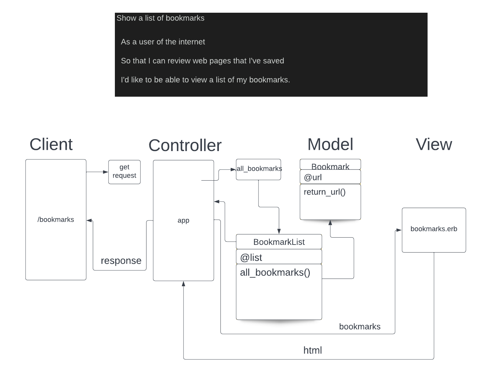

# Week-6-Databases

## User Story/Domain Model

## Setup steps
    1. Connect to psql
    2. Create the prod database using the psql command CREATE DATABASE 3. bookmark_manager;
    4. Connect to the database using the pqsl command \c bookmark_manager;
    5. Run the query we have saved in the file 01_create_bookmarks_table.sql
    6. Create test db with CREATE DATABASE "bookmark_manager_test"; 
    7. Run the same query in 01_create_bookmarks_table.sql to create a table in the test db too
